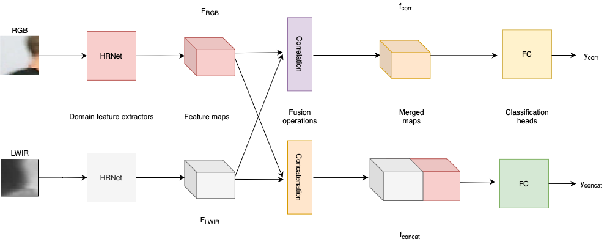

# VisiTherS

This work is the second part of my master's project. The ` Main ` branch consist of the project shown in my master's theisis, and the code in the ` Transformer ` branch is a work in progress, replacing the head of the network by a transformer. More details will come on the architectures.

## Architecture

Here is an architecture of the project. HRNet being the feature extractor of both input patches. The head of the network consist of a concatenation and a correlation branch both estimating the disparity individually, and the disparity estimation is given by the mean of both disparity estimation.


The goal of the ` Transformer ` branch is to replace the concatenation and correlation branch with a single transformer branch. the transformer block added is from the [stereo transformer repository](https://github.com/mli0603/stereo-transformer).

## Conda env

We have generated a list of the Conda environement in the ` conda_pkgs.txt ` file. We have generated this with the following commang:

```
conda list --explicit
```

## Train

```
python3 train.py    --fold 1 \ 
                    --datapath /path/to/datasets/folder \  
                    --cfg hrnet_config.yaml \ 
                    --batch_size 24 \ 
                    --learning_rate=0.001
```

### Pretrain 
 We have initialisez our training weights using a pretrain HRNet model. That can be downloaded [here](https://github.com/HRNet/HRNet-Semantic-Segmentation).  The pretrain weights are found in the file name: ` hrnetv2_w48_imagenet_pretrained.pth `


## Test
```
python3 test.py --fold 1 \
                --model stereohrnet \
                --loadmodel /path/to/pretrain/model.pt  
                --max_disparity 64 \ 
                --datapath /path/to/datasets/folder \  
                --cfg hrnet_config.yaml 
```

## Personal info

For any question feel free to contact me on my email on my GitHub profile [@philippeDG](https://github.com/philippeDG).

## License

This work is based on the work of [Beaupre et al.](https://github.com/beaupreda/domain-networks) 


### Version of the project (commit hash)
- Adding the mask on the original code base: On a diffecent repository: https://github.com/philippeDG/4D-MultispectralNet
- Replacing CNN backbone with hrnet: 607506831fbaf9c528bf195d55b24e133a6467fe
- Adapting HRNet to our network: de5754dc6343d45fe3f4be9619142b87a41499be
- Adding mask to the HRNet architecture: main
- WIP on new transformer head: On Transformer branch
